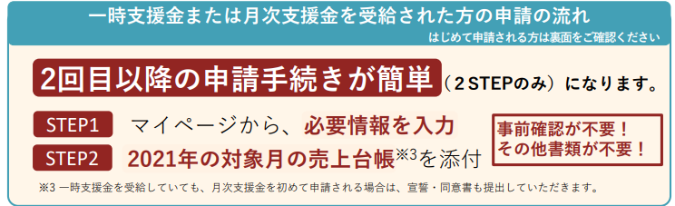

# 月次支援金

もらえる／経済産業省

<panel text="個人事業者等" number="10" unit="万円" note="最大"></panel>

<panel text="中小法人" number="20" unit="万円" note="最大"></panel>

- 対象者：緊急事態宣言に伴う飲食店の時短営業や不要不急の外出・移動の自粛により、売上が50％以上減少した事業者等
- 対象期間：2021年4月以降
- 申請期間：令和３年６月１６日から
- 制度の概要や申請方法などは[こちらのリーフレット参照](https://www.meti.go.jp/covid-19/getsuji_shien/pdf/leaflet.pdf)
- 事前確認を受けられる[登録確認機関を探すにはこちら](https://reservation.ichijishienkin.go.jp/third-organ-search/)

<button size="large" href="https://reception.ichijishienkin.go.jp/login/">月次支援金の申請はこちら</button>

## 一時支援金で事前確認を受けた方は事前確認不要

**一時支援金で事前確認を受けた方は、改めて事前確認を受ける必要はなく、宣誓・同意書（初回のみ）と、対象月の売上台帳を添付して必要事項を記入するだけで簡単に申請できます。**

ただし、売り上げ減少を比較する年を変更する場合（一時支援金の時は2020年と比較したが、月次支援金は2019年と比較したい場合等）は、全て入力し直す必要があります。

また、一時支援金とは別のアカウントで月次支援金を申請したい場合は、改めて事前確認を受ける必要があります。

## 当事務所事前確認をおこなっています

オンラインでの事前確認をご希望の方は、[お問い合わせフォーム](https://shiokaze.net/office#%E3%81%8A%E5%95%8F%E3%81%84%E5%90%88%E3%82%8F%E3%81%9B)からご連絡ください。

事務所にお越しいただける方は、電話（８３４－８８３４）または[お問い合わせフォーム](https://shiokaze.net/office#%E3%81%8A%E5%95%8F%E3%81%84%E5%90%88%E3%82%8F%E3%81%9B)からご連絡ください。

事前確認を行う前に、まずはお電話で事前確認に必要な書類等をご説明させていただき、日時を決定します。

## 事前確認の費用について

事前確認の費用は**福岡市の方は３，０００円**、**福岡市以外の方は５，０００円**とさせていただいています。

## 必要書類について

一時支援金を申請された方が新しく準備する書類は、*月次支援金用の宣誓・同意書*と、*対象月の売上台帳*だけです。（他の書類は一時支援金の申請ページから引き継がれています）

月次支援金の宣誓・同意書は[こちら](https://ichijishienkin.go.jp/getsujishienkin/assets/files/m_sensei_doui.pdf)

売上台帳は、白色申告の方と青色申告の方で必要とされている最低条件が異なるように思います。

当事務所で申請代行するときに使用している売上台帳のリンクを下記に貼りますので、売上台帳の作り方がわからない方、フォーマットがなくてお困りの方はご活用ください。

青色申告のかたの５月の売上台帳の見本は[こちら](https://docs.google.com/spreadsheets/d/1WfB0ywfRu3tS6ojQgubWtxChDrSVpoVsDh2Zo0023uw/edit?usp=sharing)

白色申告（10万円控除の青色申告含む）のかたの５月の売上台帳見本は[こちら](https://docs.google.com/spreadsheets/d/1791wePbN18KKZdlLzqVJ7vMXSXDWx0hJwt_KoCFbnwI/edit?usp=sharing)
