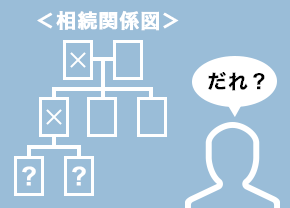

## 遺言書がない場合の相続手続き

1. 相続人の調査  
   
1. 相続財産の調査  
   
1. 法定相続情報一覧図の写しの取得
1. 遺産分割協議書の作成
1. 相続財産の名義変更

<button href="/office#お問い合わせ" size="large">🙋‍♀️ 相続手続きのご相談</button>

## 遺言書がある場合の相続手続き

1. 法定相続情報一覧図の写しの取得
1. 相続財産の名義変更

<button href="/office#お問い合わせ" size="large">🙋‍♀️ 相続手続きのご相談</button>

<callout text="できるだけ自分で相続手続きを行いたい方は、相続関係説明図、遺産分割協議書の作成や法定相続情報一覧図の作成のみも可能です。不動産の名義変更登記は、司法書士さんを無料でご紹介します。">
