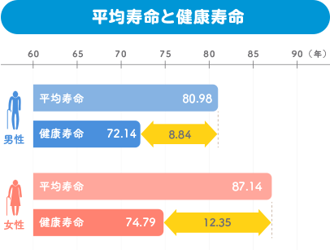
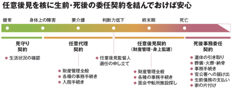
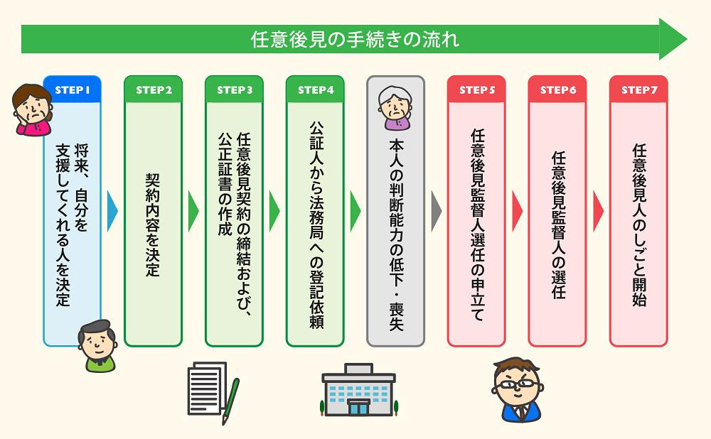

## いつ備えるか

日本人の平均寿命は、男性81歳、女性87歳です。いっぽう健康寿命は、男性72歳、女性75歳と言われています。
（健康寿命とは、健康上の問題で日常生活が制限されることなく自立した生活ができる期間）

健康寿命と平均寿命の差は「健康でない期間」となり、継続的な医療や介護の助けを必要とする期間です。健康でない期間を迎える前に、老後の備えを終えるべきだといえるでしょう。

## 何に備えるか

- 病気や介護に備える
- 残された家族の生活に備える

## 病気や介護に備える

### 生前事務委任契約

病気で入院した時や介護が必要になった時、入院手続きや預貯金の引き出し、病院への支払いなど、家族ならあなたに代わってできる手続きを家族以外の第三者に頼む場合は、事務委任契約が必要となります。

事務委任契約の内容は任意後見契約と似ていますが、あなたに判断能力（意思能力）がある場合は、たとえ寝たきりの状態でも任意後見契約を開始できません。任意後見契約を開始する基準は、身体能力ではなく意思能力にあるためです。身の回りのお世話を頼める親族が近くにいない人は、任意後見契約と同時に同じ内容の生前事務委任契約を結んでおくと安心です。

#### 生前事務委任契約でできること

生活や療養看護に関すること

- 介護サービスの利用契約
- 医療（入退院）契約
- 福祉サービスの利用契約　など

財産の管理に関する事務

- 現金、預貯金通帳、証券等の管理
- 各種支払い
- 不動産の管理　など

### 任意後見契約

任意後見契約は、判断能力があるうちに、将来あなたの後見人になってもらう人を決め、その人にお願いしたいことも決めておく契約です。認知症などによって判断能力がなくなったあとも、あなたが望んでいたような生活を実現することが期待できます。

任意後見契約にはさまざまなメリットがあると考えられます。

<case name="ケース１：確実に支援を受けられる">

いつか判断能力が衰えた時、介護保険の手続きや施設に入る手続きが必要になるかもしれません。しかし認知症になったあなたは、自分でその手続きをすることはできません。財産があっても自分のために使えないのです。任意後見契約を結んでおくことにより、任意後見人が将来のあなたに代わって、必要な時期に必要な手続きを行うことができます。

</case>

<case name="ケース２：家族間のもめごとを避けられる">

財産目当ての介護争奪戦が起こることもあれば、介護を引き受けている人がほかの親族から財産の使い込みを疑われてしまうなど、介護をとめぐって家族間で争いが起きることがあります。公正証書で任意後見契約を結んでおけば、後見人の行為はあなたの意思に基づくものだということを証明できるので、無用な家族間のもめごとを避けられます。

</case>

<case name="ケース３：法律の枠を超えた関係を続けられる">

任意後見契約は、あなたが一番信頼できる人に後見人になることをお願いすることができます。もちろん家族も後見人になれますが、長年の友人や婚外のパートナーなど、法律的に認められる家族としての権限をもたない人も、後見人としてあなたの人生に最後まで寄り添うことができます。

</case>

<case name="ケース４：自分らしい生活を続けられる">

法定後見制度は、後見が必要になってから裁判所を通して後見人をつける制度なので、あなたと全く面識のない人が後見人に選ばれることもあります。任意後見制度は、後見人も後見内容も自分で決めて契約をするので、あなたの思いを後見人へ十分に伝えることができます。そのため、たとえ判断能力が衰えたあとでも、元気だった頃のあなたが望んだあなたらしい生活を続けられると期待できます。

</case>

<case name="ケース５：望まない後見開始を避けられる">

任意後見制度は法定後見制度に優先されます。予期せぬ理由で法定後見を利用しなければならないことになっても、任意後見契約を結んでおけば、将来、法定後見人がつくことを避けられます。

</case>

<case name="ケース６：相続人でない後見人にも財産を渡せる">

任意後見契約は、無報酬の契約にすることも、月々１０万円を報酬として支払うことも自由です。友人やお嫁さんなど、相続人でないため財産を相続できない相手にも、任意後見契約の報酬として、あらかじめ決めておいた金額を生涯毎月支払うことができます。

</case>

#### 任意後見契約でできること

生活や療養看護に関すること

- 介護サービスの利用契約
- 医療（入退院）契約
- 福祉サービスの利用契約　など

財産の管理に関する事務

- 現金、預貯金通帳、証券等の管理
- 各種支払い
- 不動産の管理　など

任意後見手続きの流れ

## 残された家族の生活に備える

### 死後事務委任契約

配偶者の死は、人生で最も大きなストレスだと言われています。そのような状況の中で、葬儀や納骨、病院や施設への支払いなど、亡くなった後に必要な事務手続きをおこなうのは大変なことです。残された配偶者が高齢の場合、その負担はとても大きなものです。亡くなった後の事務手続きを安心して任せられる家族がいない方や、家族の負担を減らしたい方は、公正証書で死後事務委任契約を結んでおくことで、家族以外の人に死後事務を任せることができます。

#### このような不安があるかた

- 配偶者が高齢のため負担をかけたくない
- 子供たちが遠方に住んでいるので迷惑をかけたくない
- 頼れる親族が一人もいない

### 死後事務委任契約の内容

- 通夜、告別式、火葬、納骨、埋葬に関する事務
- 永代供養に関する事務
- 医療費の支払い
- 老人ホーム等の施設利用料の支払いと入居一時金等の受領に関する事務
- 戸籍や年金などに関する行政官庁等への諸届け
- 公共サービスの解約手続き
- 親族、友人、知人への連絡
- 賃貸物件の解約
- 携帯電話やインターネットの解約
- 家財の処分　など

### 遺言

残された家族のうち誰にどのような財産を残すのがよいのか？

正解のない問いかもしれませんが、残された家族にとって最善の策となるような遺言書を作成するお手伝いをします。

#### 遺言書を残せばこんなことができます

- 相続人が認知症になっていても相続登記ができる  
  認知症を発症している相続人は、相続手続きができません。脳機能障害などにより意思表示ができない人も同じです。相続人にそのような人がいる場合、成年後見制度を利用して成年後見人に相続手続きを行ってもらう必要があります。しかし、ひとたび成年後見人が選任されると、本人が亡くなるまで後見は続きますので、相続手続きが終われば後見人を解任するということはできません。そのため、認知症の相続人がなくなるまで相続手続を行わず、スムーズな財産の承継が行われないケースが増えています。
- 自分の財産を漏れなく相続させられる  
  夫婦間ではお互いの財産の多くを把握していると思いますが、それでも配偶者のへそくりや、親から相続していた不動産や預貯金などを完全に把握できている人は少ないかもしれません。まして子供は親の財産をほとんど把握していない状況で相続が発生することもしばしばです。
  財産目録が作成してあればよいのですが、それながない場合、どうやって財産を探すのか。相続財産を一括して調べられる機関があると思っている方もいらっしゃいますが、残念ながらそのような機関はありません。不動産なら名寄せ帳を取得したり、銀行へ故人名義口座の照会をかけたり、郵便物を確認したり遺品からヒントを探したりと、財産目がない相続は意外と大変です。結局、家族が把握している大きな財産だけ相続手続きをして、小さな相続財産は漏れてしまうことになりがちです。
- 特に心配な家族に多くの財産を残せる  
  遺言書がない場合、相続人同士の話し合い（遺産分割協議）を行って財産を分けるか、法定相続分通りに財産を分けることになります。老齢の配偶者や障害のある子供など、相続人の中に特に心配な家族がいる方は、遺言書でその家族に残す財産の内容や割合を決めておくと安心です。
- 海外に住む相続人に負担をかけずに相続手続きができる  
  相続手続きに必要な住民票や印鑑証明書などは、海外に在住している相続人は取得できません。そのため、現地の大使館でサイン証明を発行してもらうなど、相続手続きに必要な書類を集めることが大変です。遺言書を作成したときに遺言執行者を指定しておくことで、相続人の協力なく遺言内容を実行することも可能ですので、子供が海外にいる方や未成年の孫が相続人になることが分かっている方は、遺言執行者まで定めた遺言書を作成しておくべきでしょう。
- 未成年の相続人がいる場合、特別代理人を選任しなくても相続手続きができる  
  未成年者は相続手続きに参加できないので、相続人に未成年者がいる場合は、特別代理人を家庭裁判所で選任してもらい、特別代理人と一緒に相続手続きをすることになります。未成年者の親も相続人の場合は、相続手続きにおいて利益相反となりますので、その親は特別代理人になれません。また未成年の子供が複数いる場合は、複数の特別代理人が必要です。この場合も、遺言書を作成したときに遺言執行者を指定しておくことで、相続人の協力なく遺言内容を実行することが可能ですので、複雑な手続をすることなく相続手続きを終えることができます。

### 遺言に関する勘違い

遺言に関して勘違いしていませんか？

<case name="ケース１：残された家族で話し合って決めればいい">

あなたが亡くなった時に配偶者やその他の相続人が認知症を発症していたら、話し合って（遺産分割協議をして）相続財産を分けることができません。

</case>

<case name="ケース２：法律で決まっている相続分通りでいい">

相続財産に不動産が含まれている場合、法定相続分で相続すると、不動産が共有となりなすのでその後に売却したり二次相続が発生したときに大変な手間がかかります。

</case>

<case name="ケース３：預貯金が少ないから遺言書なんて必要ない">

たとえ口座に少額しか残っていなくても、亡くなった方の口座を解約するには相続手続きが必要です。少額口座の相続のために大変な手続きを必要とさせないためにも、遺言書は必要です。

</case>

<case name="ケース４：古い家だし誰も欲しがらないから遺言書なんて必要ない">

不動産を負動産として残さないためにも、生前のうちから相続人としっかりと話し合い、その解決策を遺言書にのこしておくことが大切です。不動産の相続は、空き家問題や相続争いに発展する難しい問題となることがあります。

</case>

<case name="ケース５：知り合いはみんな遺言してないから必要ない">

2020年7月10日より自筆証書遺言の保管制度が開始され、国を挙げて遺言制度を普及させようとしています。それだけ、相続人同士のトラブルが多く、遺言がないために放置されている不動産などが引き起こす社会問題が増えてきているのです。

</case>

### 公正証書遺言と自筆証書遺言の違い

#### 公正証書遺言

公正証書遺言は、相続発生後はすぐに各種手続きに利用できる遺言書です。専門家と遺言内容を十分に話し合って作成することで、法律的に不備のない遺言書を作成できます。

#### 保管制度を利用した自筆証書遺言

これまでの自筆証書遺言制度の不備を解消するために、自筆証書遺言書の保管制度が２０２０年７月１日より開始されました。これにより、自筆証書遺言の形式的な不備は、保管前に解消されますし、保管制度を利用すれば、自筆証書遺言で必要とされる裁判所の検認も不要となりました。

公正証書遺言を作成するより費用が安く、これまで遺言書の作成など考えたこともない若い世代の人にも利用しやすい制度となっています。

50代以下の方は死亡率も低いことから遺言書を作成しない方がほとんどです。しかし、若い世代の方がもし亡くなった場合、相続人が未成年者ということが多くあり、未成年者が相続人の相続手続きはとても大変です。

遺言書を残す手間とは比べられないほどの負担を家族に残さないためにも、「子供ができたらとりあえず遺言」というくらいのハードルの低さで自筆証書遺言の保管制度を利用してほしいと思います。
